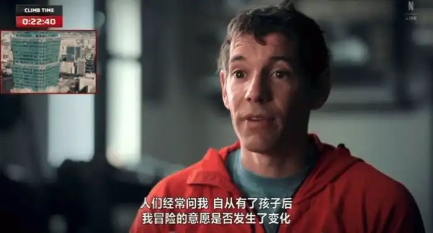
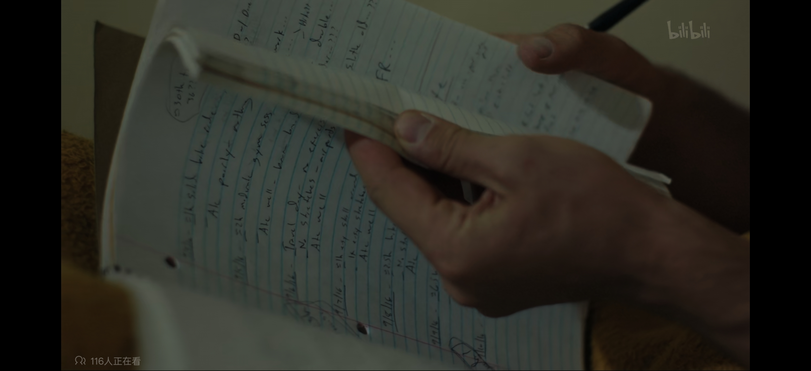
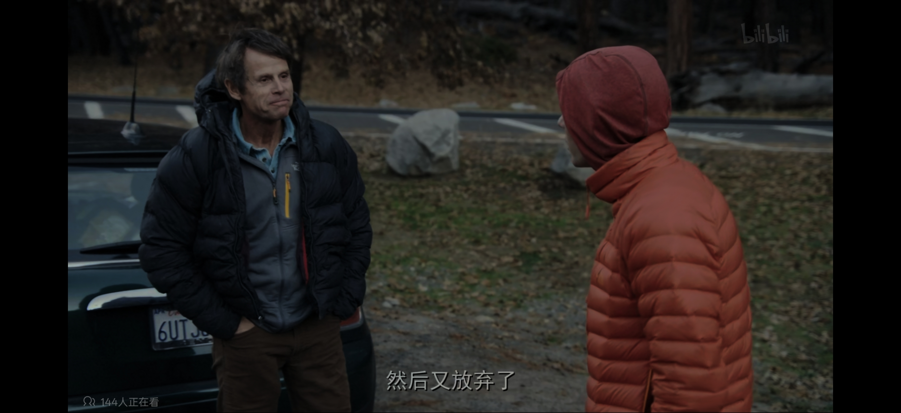

---
title: 看《徒手攀岩》
--- 

## toc

##

酋长岩对我来说，最早只是一张 Mac OS X El Capitan 的壁纸，它看起来宏大，但也只是另一面著名岩壁。  
  
  

但对酋长岩真正重要的，从来不是它被如何观看，而是它被如何攀登。  
  
The Nose 证明它不是神话，而是现实；Salathé Wall 开始追问，在已经能上去之后，我们该不该这样上去；而 Freerider，则把攀岩者多年在酋长岩积累下来的确定性推到了一个几乎不允许侥幸的边界。  
  
## 我们入如何面对家庭这个话题

> “Free soloing doesn’t really fit well with having a family.”  
>   
> “徒手攀岩并不适合有家庭的生活。”  
  
  
年关将至，这是我工作的第一年。为了回一趟家，我需要提前两周抢票，换乘动车和大巴，用一整天完成一条并不轻松的路径。从效率上看，这并不是一个理性的决定，但我仍然选择回家，因为有些关系本身就意味着你要为它付出额外成本。  
  
对现在的 Alex 来说，家庭同样改变了成本结构。他和妻子 Sanni 已育有两个女儿，他想陪她们长大，这并没有让他停止攀登，但迫使他对每一次攀登进行更严苛的准备与自我评估。不是因为冲动，而是因为他清楚，自己正在为谁承担后果。  
  
当被问到“成为父亲之后还能否承受这样的风险”时，他的回答冷静得近乎残酷：“我不觉得计算方式改变了多少。我以前也不想死，现在也不想死。有孩子之后，你会特别不想死，但我一直都在尽我所能不去死。”  
  
  
  
  
  
## 我们如何面对生命这个话题  
  
> “If I feel like I’m relying on luck, then I shouldn’t be there.”  
>   
> “如果我觉得自己需要靠运气，那我就不该在那条路线上。”  
  
小时候我以为死亡是一件有顺序的事：年纪大的人先走，年纪小的人在后。后来才明白，人并不是老了才会死，而是随时都可能死。区别只在于，你是否意识到这一点。  
  
在《徒手攀岩》中，Alex 的每一步都建立在计算之上，而不是率性而为。Freerider 是一条几乎不允许侥幸的路线：落石、岩点断裂、风向变化这些客观风险无法被完全消除，判断、技术和心理这些主观风险也始终存在。但正因为如此，他才反复练习、反复确认，把“可能会死”压缩到一个他认为不依赖运气的区间。  
  
  
  
他的大脑需要更高刺激才会产生恐惧反应，但这并不意味着他会硬撑着上墙。相反，只有在状态完全准备好时，他才会出现在酋长岩上。  
  
他并不是不接受死亡的存在，而是不接受把生命交给概率。  
  
  
  
  
  
  
  
  
