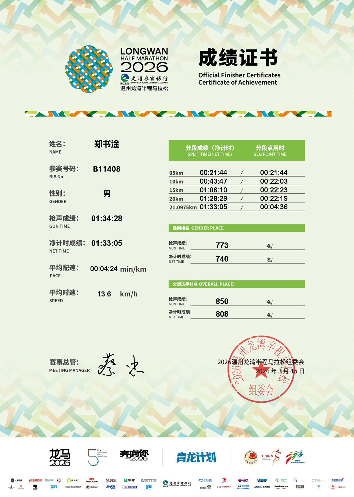
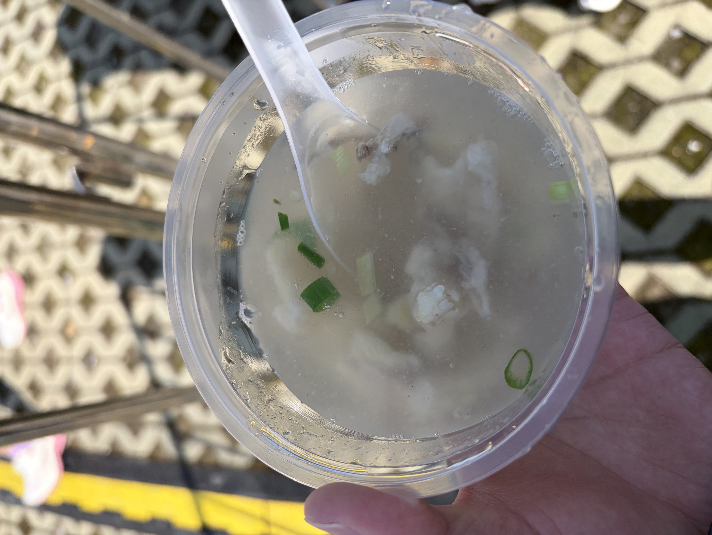

---
title: 温州龙湾半马：PB 3 分 9 秒！  
tags:
    - 跑步
--- 
  
查询到温州龙湾半马的成绩证书后，对我来说也意味着 2026 年上半年的比赛全部结束了。

这次不仅刷新了去年 12 月在宁德马拉松跑出的个人最好成绩，成功 PB 了 3 分 9 秒。短短 3 个月能有如此进步，确实让我非常满意。同时也由衷佩服国内跑者的整体水平，现在的赛事水平进步神速，赛后看到领取"破130"纪念服的队伍排了好几百人，高手云集，实在厉害！

## 赛道

赛道累计爬升不到 50 米，体感非常平坦。

起跑前我还有些担心，因为没留意公众号通知错过了修改分区的机会，导致原本符合 A 区成绩的我被分在了 B 区。所幸 1 公里后人群就逐渐散开，不用再左右穿梭。

下次中签后，一定要盯紧分区信息。

## 美食

领完完赛包后直奔美食区，茶叶蛋、鱼丸汤、炒粉、猪油糕应有尽有。我坐在那儿猛猛爽吃了一顿才回酒店。尤其是那个鱼丸汤，鲜美得让我连喝两碗才舍得走。

## 温州

最后聊聊温州。在网络还不发达的年代，我对这里的印象还停留在"江南皮革厂"的调侃里，后来则是那段沉重的铁路事故记忆。

赛道两旁，温州人民的加油声响彻街道；公园里，男女老幼闲适惬意。这座城市，远比手机里看到的更加生动。

## 尾巴

三个月前在宁德，我第一次跑进 130。当时觉得那是极限了。

现在发现，极限这东西，只要你继续跑，它就会往后退。

上半年的比赛结束了，但训练不会停。下半年见。
