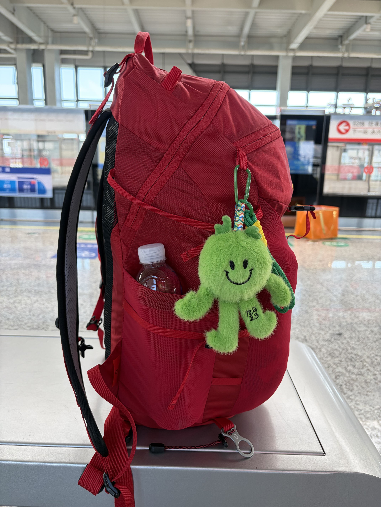
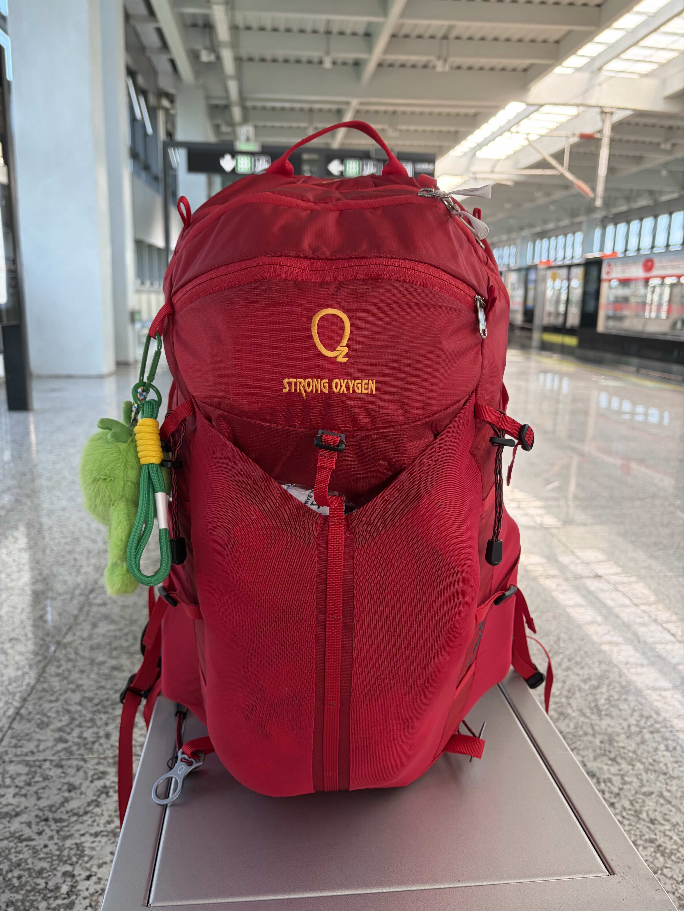

---
title: 出门在外真正的必需之物有哪些？ 
---   
  
极简主义应该是用最少的东西把事情都给干了，出去旅游对于带哪些东西更是要克制，每一样东西都将成为肩膀和手上的负担，充电宝能自带线就少带一根充电线，能用多口充电器就不多带一个充电器。  
  
一个人出行所带的物品应该是极简且必须的了，否则将无法正常生活，按照这个标准来盘点一下我的所有资产有哪些可以称得上「拿钱办事」的。  
  
  
## 一台拿出来马上就可以干活的电脑  
  
我的笔记本电脑依然是 2020 年 MacBook Pro M1，陪我从大一到工作，买它的时候花的钱也已经都靠它赚回来了。  
  
倒不是说旅行也要关注工作，出门在外一般忙的也是自己的副业或者私活，做多少的结果都是自己收益，这个时候的做事情的动力也便不一样了。哪怕我的手机性能比那台 MacBook Pro 要更强了，但一个完整的桌面级操作系统带来的安全感可不是完全能由性能来代替的。  
  
## 一台安卓旗舰手机  
  
我使用的是 Find X9 Pro，有着 7500mAh 电池、足够强的主摄和长焦，为什么用 Mac 还推荐安卓呢，现在的安卓机与 Mac 的互联都算得上可用，如果不是非 iOS 不可，我也找不到什么要用 iPhone 的理由，虽然我还是买了一台 iPhone 配合安卓使用，不过只推荐一台手机的话我还是会选择安卓旗舰而不是 iPhone，在同价位上安卓旗舰表现出的产品力是优于 iPhone 的。  
  
恰好你的需求也是下面这些，Find X9 Pro 或许对你来说也是一个不错的选择。  
* 手感好  
* 7500 mAh 的电池足够一天上班通勤不用充电  
* 相机不是奥利奥造型  
* 主摄绝对画质没落后于超大杯旗舰太多  
* 长焦在 10 倍以内的的画质都很可用  
  
## 一双走路足够舒服的鞋子  
  
出门旅游一天步行至少是 2 万步起，脚上如果不是一双适合走路的鞋子估计是要走到道心崩溃了。鞋子的舒服有来自于鞋面的包裹，也有中底的回弹，如果它还能让我跑个步就更好了，New Balance Rebel V4 对我来说就是一双这样的鞋子，它没有 574 和 992 的经典外观 ，甚至每代 Rebel 的设计风格都不太相同，可通勤、跑步再加上一个不错的外观成为了鞋柜子全能的存在。  
  
## 一个舒适的耳机  
  
在耳机的选择上很纠结，一面是 FreeClip2 的无感，另一个是 AirPods Pro 的降噪，如果非得选一个那我还是会选择 AirPods Pro，毕竟音乐不一定要听，但是吵一定是不可接受的。  
  
## 一个 3C 认证充电宝  
  
周末去附近城市走走看看在外面走一天也不用担心电子设备会没电，又或是和三两好友在周末爬座小山，在外旅游或多人出行带个充电宝准没错，最近民航对充电宝的管理措施也越来越严格了，买个大品牌 3C 认证的充电宝也是对自己的出行安全负责。  
  
## 一个 26 升的背包  
  
26 升说大不大，只够装下 2 个人三天两夜的换洗衣物，但作为打工人有个周末能出门走走玩玩也已经是蛮开心的事情了，装满背包后说走就走，在路途中不用手推行李箱解放了双手后的旅途和带着行李箱拖着的体验完全是两码事，甚至在买了一个 26 升的背包后有了买个 38 升的。  
  
  
 
 