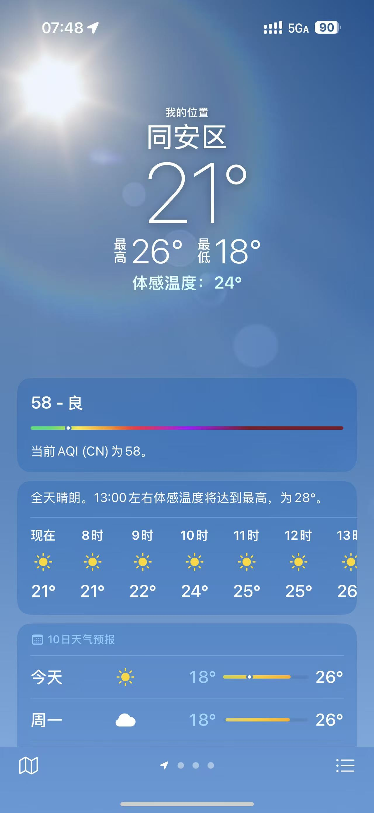
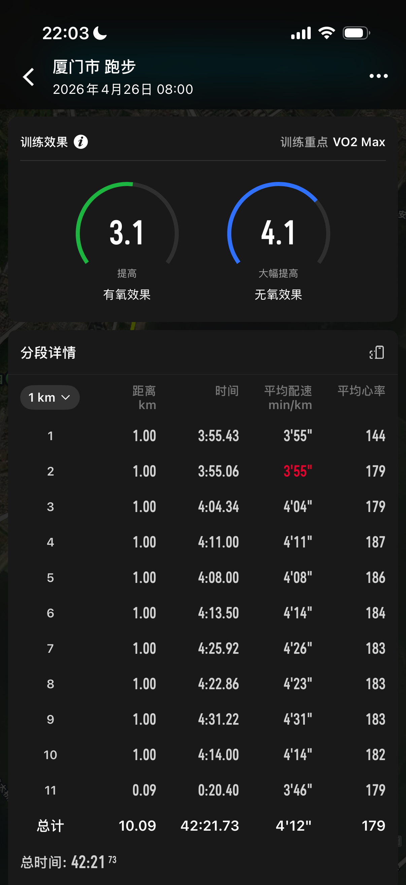
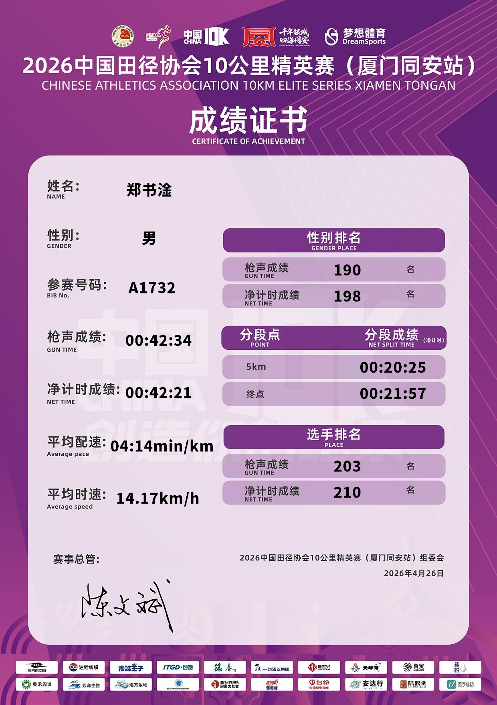
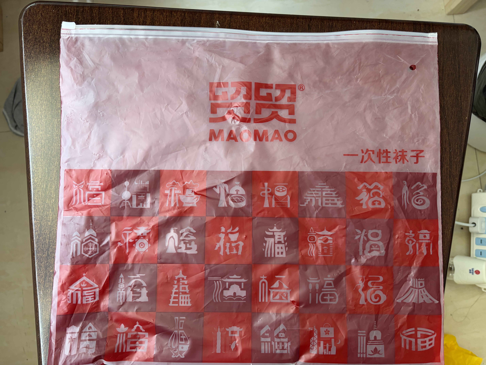

---
title: 同安 10K 复盘
tags:
    - 跑步
---   

## 赛前

同安 10 公里这个比赛原定是在 3 月 29 日，那个时候刚好是龙湾半马结束两周，想想自己应该是恢复不过来就没报名，跑完半马比赛去数字心动一看同安 10K 公里延期到 4 月 26 了，转念想想四月底的厦门也是够热的但还是报名了，一是已经很长时间没认真的跑 10 公里这个距离了，想看看自己的实力到底有几斤几两，二是来厦门一年了还没参加过主场的比赛，可以预见的是下半年的海沧和环东半马会和宁德还有福州撞在一起，厦门马拉松中签不了，今年在厦门有机会参赛的只有这场了。
  
赛前两周看完了丹尼尔斯跑步训练法，了解了使用 VDOT 来规划自己的跑步计划，书中也提到：

用个人比赛时间估算训练强度和其他比赛的表现，其预测效果比实验室测试的预测效果更好。比赛时间能反映出你的最大摄氧量、跑步效率、乳酸门槛和比赛时的心理情况。

为了更好的来规划自己下个周期的训练所以不管天气如何都打算冲一把试试，最坏的结果就是中途退赛了，如果能体验一把退赛倒也不错哈哈。

从龙湾半马结束到同安 10K 的比赛只有 6 周的时间，算上恢复的一周，满打满算只有 5 周的时间来强化自己的速度能力，前 3 周把周末的 15 公里定速长距离换成了 5 公里慢跑，5 公里马配，5 公里慢跑，后 2 周每周是一个乳酸阈值跑和一个重复跑。

运气好的是在某次训练中认识了张哥和廖哥，张哥刚刚在 3 月的无锡马拉松破三，这次赛前说他没目标，我就说我跟你前 5 公里吧，结果他带了我一路，赛中至少回头看了我 10 次，在补给点帮我拿水，没他这次 10 公里注定跑崩。廖哥的分区在 B 区就没一起起跑，他也是跑了一个很好的成绩出来。

## 赛中

赛前几天厦门下了几场雨，每次下雨都期待周日是个阴天，但天气预报早早的在周二周三就预告周日是个大晴天。

终于到了比赛那天，太阳按时升起，到了 8 点起跑时体感温度 24 度，气温 21 度，注定了这次是一次大考，同安 10K 的赛道是一个 5 公里的路线，5 公里点处开始折返一次。

起跑后前 2 公里表显配速都在 4 分内，想着这次 5K 破 20 分或许有戏，到了 3 公里口渴的感觉已经上来了，速度也掉到了 4 分外，其实 3 公里左右就有点没跟上张哥，他回头看了我好几次说：感觉不行我们就放了，已经超过 45 分的兔子稳住就好，我当然是一如既然的嘴硬说还行，你待会别管我，自己猛猛冲。到 5 公里计时点还有 100 米左右表显时间已经到 20 分了，虽然破 20 无望但是 5K 还是 PB 了 1 分钟。

折返真正的考验才开始，不到 6 公里处碰到廖哥，互相道了句加油后就感觉大腿开始上酸了，撑过 6 公里后 7 - 9 公里开始疯狂掉速到 430 左右，7.5 公里张哥帮我拿了水和降温海绵之后缓了点过来，张哥在最后 1.7 公里的时候说最后 1 公里再加速冲一下，而我却在他说完之后又掉速了一些，再过 1 分钟后就在人群中看不到他的背影了。

到 9 公里打开相机说最后 1 公里加加速冲上去给张哥拍个冲线视频，最后只加速到了 414 还是没跟上。

## 赛后

比赛结束后的五一假期就可以根据上半年两次比赛的成绩来制定下个赛季长达 24 周的训练周期了，比赛是拿去检验自己能力最好的时候，去年在把速度训练放掉只跑有氧跑的情况下都可以在下半年 PB 14 分钟，这次我想试试根据自己的情况来制定一个课表能把自己的能力提升到一个什么程度。

3 月的半马 13309 和 4 月的 10 公里 4221，清楚认识到自己的 VDOT 值差不多就在 49 这样，终于可以安心的进入到夏训的周期中了。

还是要吐槽一下这次同安 10K 的补给，我不是一个对参赛包、完赛包很有要求的一个人，但这次完赛包只有矿泉水连香蕉这样最基本的补充碳水的物资都没有就过分了。

放一下这次完赛包。

## 尾巴

2026 年 4 月 26 日，萨维和科杰尔查把人类马拉松带进 2 小时以内，萨维冲线之后他并没有开始庆祝甚至进入了贤者模式，或许他认为自己的实力可以跑的更快些，又可能已经在计划下一场比赛要如何准备了。

同一天我却在厦门同安区挣扎着跑完 10 公里比赛，内心也没什么波澜，因为我知道这次已经尽自己最大努力了，埋怨天气也无用，同场赛事的第一也照样跑出 32 分台的成绩，或许这就是跑步的魔力，不管成绩如何继续努力准备下一场赛事吧。